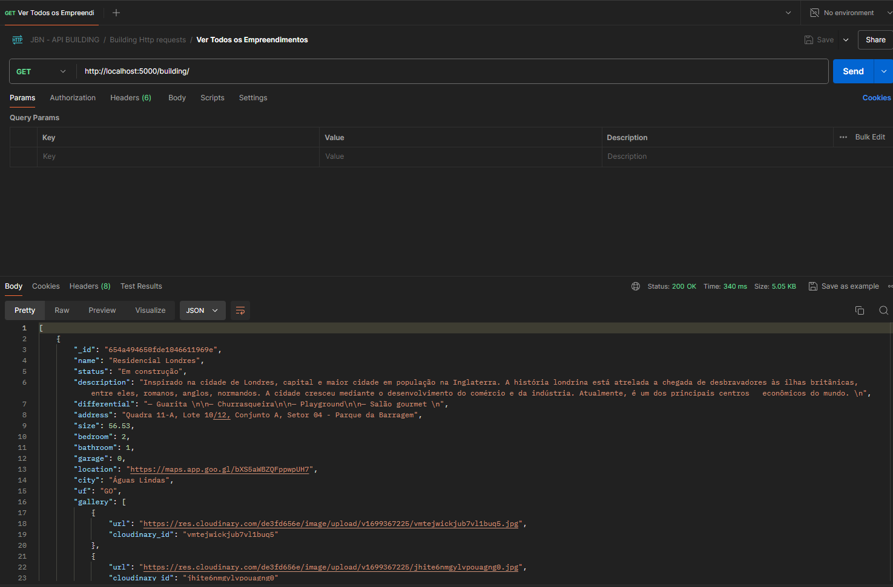

# Sistema de controle dos Empreendimento - API RESTful JBN Construções

Um backend robusto desenvolvido com Node.js e Express para gerenciar acesso aos dados através de uma API RESTful, utilizando MongoDB para armazenamento e Cloudinary para gerenciamento de imagens.

## Índice

- [Sistema de controle dos Empreendimento - API RESTful JBN Construções](#sistema-de-controle-dos-empreendimento---api-restful-jbn-construções)
  - [Índice](#índice)
  - [Tecnologias Utilizadas](#tecnologias-utilizadas)
  - [Funcionalidades](#funcionalidades)
  - [Instalação](#instalação)
  - [Demonstração da API](#demonstração-da-api)
    - [Exemplo de requisição POST para criar empreendimentos da JBN](#exemplo-de-requisição-post-para-criar-empreendimentos-da-jbn)
    - [Exemplo de requisição GET ALL para listar empreendimentos da JBN](#exemplo-de-requisição-get-all-para-listar-empreendimentos-da-jbn)
    - [Exemplo de requisição GET ONE para consultar um empreendimento com base no ID](#exemplo-de-requisição-get-one-para-consultar-um-empreendimento-com-base-no-id)
    - [Exemplo de requisição PATCH para atualizar um empreendimento com base no ID](#exemplo-de-requisição-patch-para-atualizar-um-empreendimento-com-base-no-id)
    - [Exemplo de requisição DELETE para deletar um empreendimento com base no ID](#exemplo-de-requisição-delete-para-deletar-um-empreendimento-com-base-no-id)
    - [Exemplo de Requisição para criar usuário](#exemplo-de-requisição-para-criar-usuário)
    - [Exemplo de Requisição para logar o usuário](#exemplo-de-requisição-para-logar-o-usuário)
    - [Exemplo de requisição para listar usuários cadastrados](#exemplo-de-requisição-para-listar-usuários-cadastrados)
  - [Contribuição](#contribuição)
  - [Licença](#licença)


## Tecnologias Utilizadas

- Node.js
- Express.js
- MongoDB
- Cloudinary

## Funcionalidades

- Criação, leitura, atualização e remoção (CRUD) de empreendimentos através dos métodos HTTP:
  - GET: Recuperar dados
  - POST: Criar novos dados
  - PATCH: Atualizar dados existentes
  - DELETE: Remover dados
- Autenticação e controle de acesso aos endpoints
- Manipulação de imagens utilizando Cloudinary

## Instalação

1. Clone o repositório:
   ```bash
   git clone https://github.com/rodrigoMedeiros0/jbn_backend
   cd seu-projeto
2. Instale as dependências:
    ```
    npm install
4. Antes de iniciar o servidor, certifique-se de configurar as variáveis de ambiente necessárias. Crie um arquivo `.env` na raiz do projeto com base no `.env.example`      fornecido:

    ```
    #Exemplo de `.env`

    PORT=5000
    DB_USER=seu_usuario_do_mongodb
    DB_PASS=sua_senha_do_mongodb
    SECRET=sua_chave_secreta_para_tokens_jwt
    CLOUDINARY_NAME=nome_da_sua_conta_no_cloudinary
    CLOUDINARY_API_KEY=chave_api_do_cloudinary
    CLOUDINARY_API_SECRET=segredo_api_do_cloudinary


## Demonstração da API

### Exemplo de requisição POST para criar empreendimentos da JBN

Para criar um novo empreendimento, faça uma requisição POST para o endpoint `http://localhost:5000/building/` com os seguintes campos:


    Corpo da Requisição (JSON):
    
    {
    "name": "Residencial Teste",
    "status": "Em construção",
    "description": "descricao",
    "bedroom": "3",
    "bathroom": "5",
    "garage": "1",
    "location": "https://www.google.com/maps/place/McDonald's/@-15.8161145,-47.9793904,15z/data...",
    "city": "aguas lindas",
    "uf": "GO",
    "size": "60",
    "address": "Rua 1",
    "gallery": [
        "imagem0.jpg",
        "imagem1.jpg",
        "imagem3.jpg",
        "imagem4.jpg"
    ],
    "differential": "Texto do diferencial"
    }


### Exemplo de requisição GET ALL para listar empreendimentos da JBN

Para listar todos os empreendimentos da JBN, faça uma requisição GET para o endpoint `http://localhost:5000/building/`:



### Exemplo de requisição GET ONE para consultar um empreendimento com base no ID

Para consultar um único empreendimento da JBN, faça uma requisição GET para o endpoint `http://localhost:5000/building/id` passando o id do empreendimento:


### Exemplo de requisição PATCH para atualizar um empreendimento com base no ID

Para atualizar um empreendimento da JBN, faça uma requisição PATCH para o endpoint `http://localhost:5000/building/id` passando o id do empreendimento e com os seguintes campos:


Corpo da Requisição (JSON):
   
     {
          "name": "Residencial para alteracao",
          "status": "Em andamento",
          "description": "descricao teste",
          "bedroom": 4,
          "bathroom": 2,
          "garage" : 0,
          "location": "https://www.google.com/maps/place/McDonald's/@-15.8161145,-47.9793904,15z/data=!4m6!3m5!1s0x935a319af6a509e3:0xb6790c007c0083f2!8m2!3d-1 8161145!4d-47.9793904!16s%2Fg%2F1yfjf1cm6?entry=ttu",
          "address": "rua 04",
          "city": "Brasília",
          "uf": "DF",
          "differential": "texto diferencial 12"
    }
    
    

### Exemplo de requisição DELETE para deletar um empreendimento com base no ID

Para deletar um empreendimento da JBN, faça uma requisição DELETE para o endpoint `http://localhost:5000/building/id` passando o id do empreendimento:


### Exemplo de Requisição para criar usuário 

Para criar um usuário para ter acesso as requisições da JBN, faça uma requisição POST para o endpoint `http://localhost:5000/auth/register` 


Corpo da Requisição (JSON):
    ```json
    
    {
        "name": "Rodrigo",
        "email": "rodrigo@gmail.com",
        "password": "123456789",
        "confirmPassword": "123456789"
    }

### Exemplo de Requisição para logar o usuário 

Para ter acesso ao sistema da JBN, faça uma requisição POST para o endpoint `http://localhost:5000/auth/login` 


Corpo da Requisição (JSON):
    ```json
    
    {
        "email": "rodrigo@gmail.com",
        "password": "123456789",
    }

### Exemplo de requisição para listar usuários cadastrados

Para listar todos os usuário da JBN, faça uma requisição GET para o endpoint `http://localhost:5000/auth/users`:


## Contribuição

Contribuições são bem-vindas! Para contribuir com este projeto, siga estas etapas:

1. Fork o repositório
2. Crie uma branch para sua contribuição (`git checkout -b feature/sua-contribuição`)
3. Commit suas mudanças (`git commit -am 'Adicionando nova funcionalidade'`)
4. Push para a branch (`git push origin feature/sua-contribuição`)
5. Abra um Pull Request
   
## Licença

Este projeto está licenciado sob a [MIT License](LICENSE).

